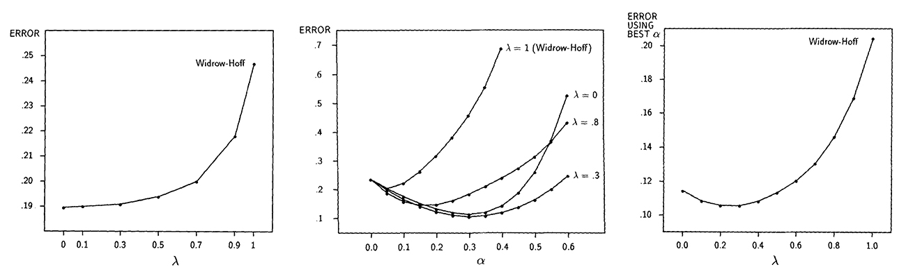
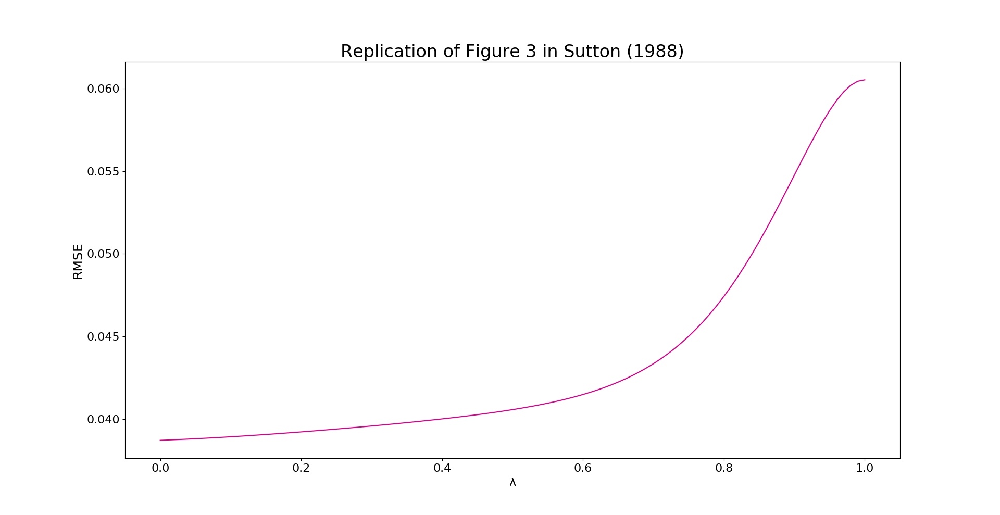
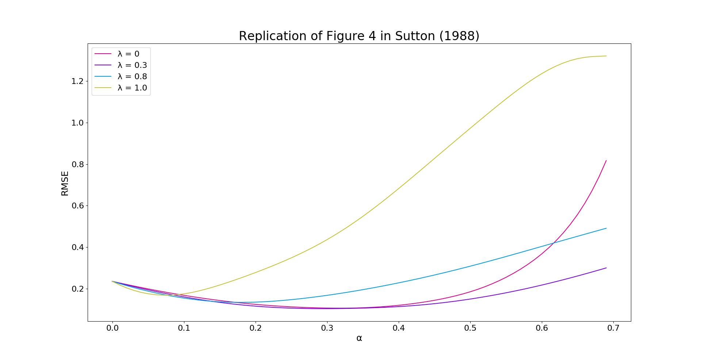
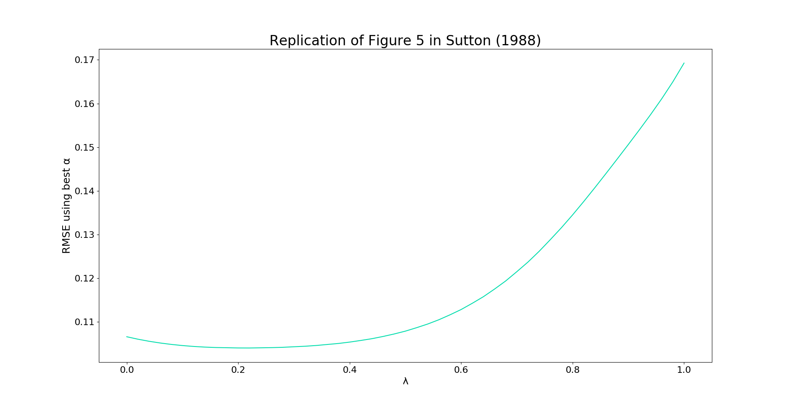

# TD(λ) Learning and Random Walks
by Vince Petaccio
### Reproducing Sutton's 1988 Results
The goal of this work was to replicate the results found in Richard Sutton's 1988 paper entitled *Learning to Predict by the Methods of Temporal Differences*:

The resulting figures confirm the reproducability of Sutton's results:

See [the analysis](TD_Lambda_Replication.pdf) for a more in-depth review of the original paper and of these reproduced results.

### Running the Code
Ensure that the NumPy and Matplotlib libraries are installed on the system and are activated within the environment.

Open td_learning.py and set the appropriate experiment switches to True at the top of the file, and then run the code to run the experiments. Note the runtimes listed next to each switch; because many values are calculated for smooth plots, some of the experiments take a while.
